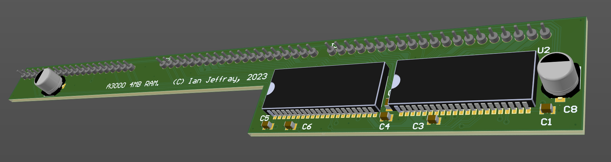

# Acorn A3000 4MB RAM card

June 2023

This is my implementation of a 4MB RAM card for Acorn A3000 machines. using two 16bit RAM parts.

Rev 1.0 has been built and lightly tested with no operational issues found, though it transpires that the RAM card connectors are not spaced on a 0.1" grid, so the left-hand connector was 0.025" too far away from the others, causing fitting to be a bit of a strain on the pins - this has been corrected for Rev 1.1 as of end of May 2023, though that revision showed a byte lane problem as CAS2/CAS3 swapped - corrected in latest version, but not built yet.

## Licence

No warranty is provided, and this work is used at your own risk.  

Licenced as CC BY-SA 3.0

Copyright 2023 Ian Jeffray
