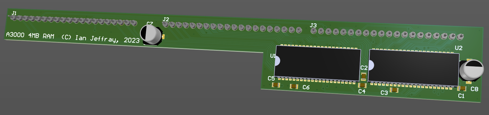

# Acorn A3000 4MB RAM card

July 2023

This is my implementation of a 4MB RAM card for Acorn A3000 machines. using two 16bit RAM parts.

The latest revision has been built and tested with no operational issues found.

## Licence

No warranty is provided, and this work is used at your own risk.  

Licenced as CC BY-SA 3.0

Copyright 2023 Ian Jeffray
